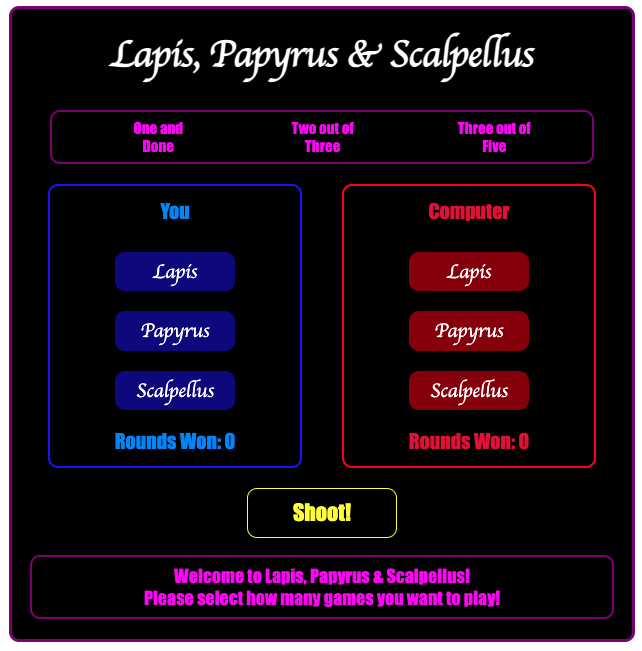

# Lapis, Papyrus & Scalpellus

- Lapis, Papyrus & Scalpellus is a simple game that is latin for Rock, Paper, Scizzors.

## Technologies Used

- HTML
- CSS
- Javascript

## Getting Started

- Pick how many games you want to play against the computer.
- Pick either Lapis, Papyrus or Scalpellus.
- Click Shoot!!!

## About Development

- Project Lapis, Payrus, and Scalpellus is my creation for admission into the General Assembly Software Engineering Immersive Program. A unique twist on the classic Rock, Paper, Scissors, the game incorporates Latin elements and boasts a design developed entirely from scratch. Notably, this project marks my initiation into the construction of applications with layered logic, offering players the ability to win, lose, and engage in matches against a computer opponent. This endeavor reflects both my technical prowess and commitment to mastering software engineering, serving as a pivotal milestone in my development journey.

